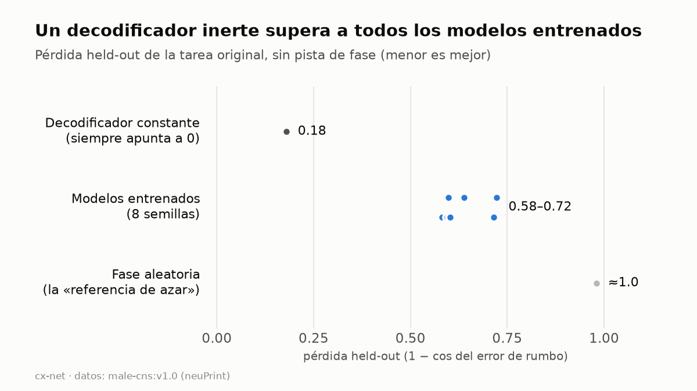
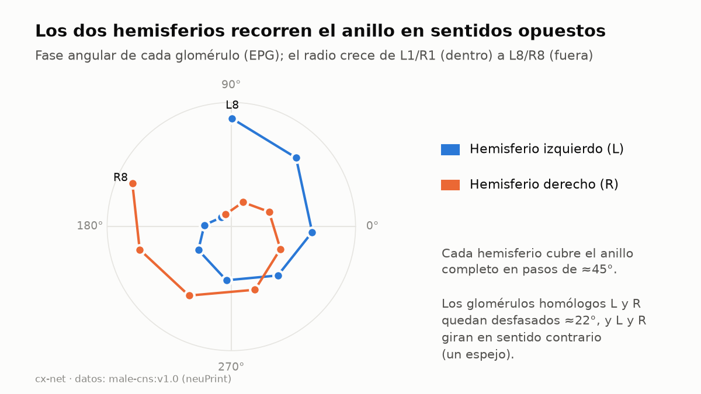
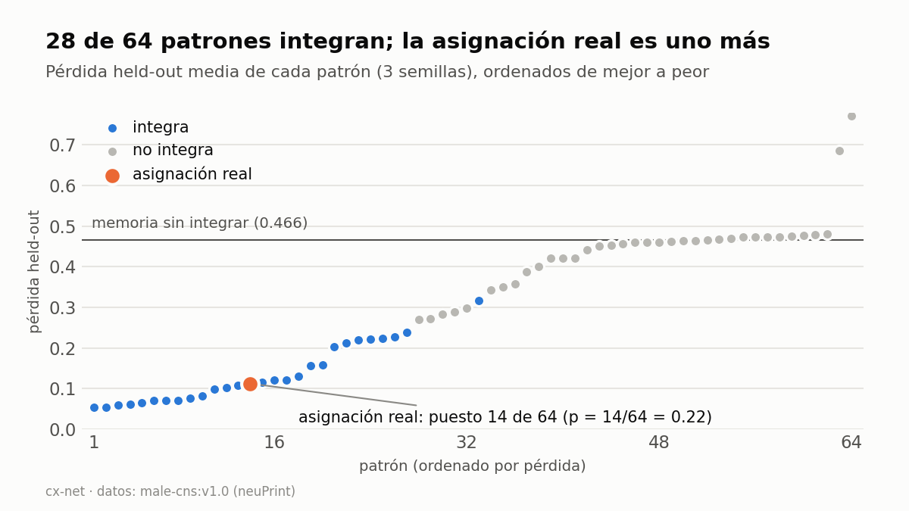
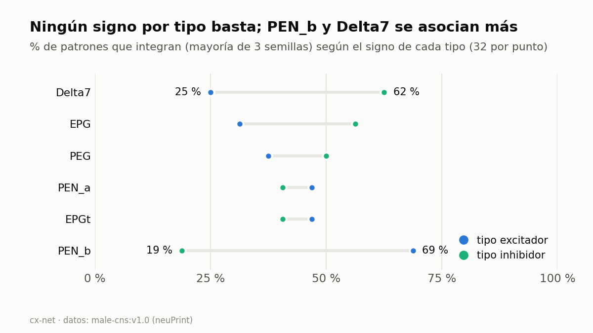
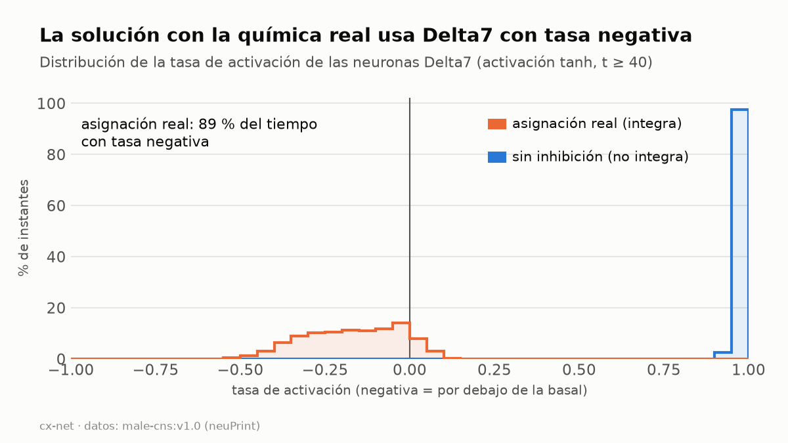
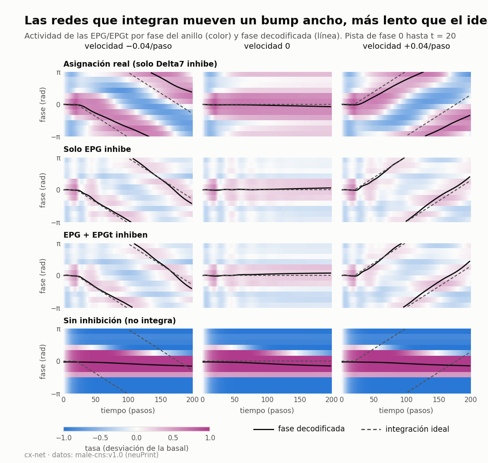

# CX-Net

Validación cruzada entre pesos aprendidos por una red neuronal restringida por el connectoma del complejo central de *Drosophila melanogaster* y su neurotransmisor real anotado.

## Pregunta de investigación

Si se entrena una red neuronal cuya única restricción es la topología sináptica real del complejo central (sin indicarle qué conexiones son excitadoras o inhibidoras), dejando el signo de cada peso completamente libre, ¿converge por sí sola hacia el neurotransmisor real ya anotado en el dataset, más allá de lo esperable por azar?

## Estado

Fase experimental cerrada (2026-09-20); redactando el preprint como informe
metodológico y negativo.

Resultado principal: **no hay evidencia de que un aprendiz de signos recupere el
neurotransmisor real, y el diseño no permitía encontrarla.** Hallazgos: (1) la
tarea original era resoluble de forma trivial (un decodificador constante
superaba a los modelos entrenados); (2) la fase angular real de cada neurona en
el EB, medida con coordenadas de sinapsis, es un espejo entre hemisferios que
los mapeos asumidos no recogían; (3) con ganancias por tipo celular existe una
solución que integra el rumbo, pero no es específica de la química real (28 de
64 patrones de signo por tipo la alcanzan, con 3 semillas; la real, puesto 14) y usa tasas con
signo (desviaciones de una basal nula) que hacen el signo poco identificable; (4) un aprendiz de signos genérico no la
encuentra; (5) en este subcircuito el neurotransmisor es función exacta del tipo
celular (Delta7 = glutamato, resto = acetilcolina). Detalle y retractaciones en
[`docs/preprint-discussion.md`](docs/preprint-discussion.md) y
[`docs/lab-notebook.md`](docs/lab-notebook.md).
Ver hoja de ruta más abajo.

## Figuras

Se regeneran con `python -m src.cx_net.make_figures [--lang es|en|all]` (leen solo de `results/`).
Versiones en inglés en [`docs/figures/en/`](docs/figures/en/); resumen en inglés en
[`docs/summary-en.md`](docs/summary-en.md) (English summary).








## Datos

- Conectividad del subcircuito CX (PB, EB, FB, NO) vía [neuprint-python](https://github.com/connectome-neuprint/neuprint-python) (hemibrain, dataset piloto) y [caveclient](https://github.com/CAVEconnectome/CAVEclient) (MaleCNS v1.0).
- Neurotransmisor real anotado por síntesis (Eckstein et al., 2024) — reservado como *ground truth* oculto, nunca visto durante el entrenamiento.

## Roadmap

| Fase | Descripción | Semanas |
|---|---|---|
| 1 | Extracción del grafo (sin signo) | 1–3 |
| 2 | Modelo de signo libre (PyTorch + PyTorch Geometric) | 3–6 |
| 3 | Controles estadísticos (modelo nulo, preserva grado) | 6–8 |
| 4 | Evaluación y desglose por neuropilo/tipo celular | 8–10 |
| 5 | Redacción y difusión (preprint + LinkedIn) | 10–12 |

## Setup

```bash
python -m venv .venv
.venv\Scripts\activate      # Windows
pip install -r requirements.txt
cp .env.example .env        # añadir NEUPRINT_TOKEN (neuprint.janelia.org > Account > Auth Token)
```

## Uso

```bash
python -m src.cx_net.extract_graph
```

Genera `data/raw/graph_no_sign.csv` (topología pura, sin signo) y
`data/raw/ground_truth_nt.csv` (neurotransmisor real, uso restringido a la
fase de evaluación). Ambos quedan fuera del repositorio (`.gitignore`).

Fases posteriores (módulos en `src/cx_net/`; los resultados se escriben en
`data/interim/`, fuera del repositorio):

```bash
python -m src.cx_net.train          # entrena el modelo de signo libre
python -m src.cx_net.evaluate       # H1 (test de permutación) y H2 (por tipo celular)
python -m src.cx_net.extract_eb_angles  # fase angular real de cada neurona (sinapsis del EB, neuPrint)
python -m src.cx_net.analyze_types      # análisis de los 64 patrones de signo por tipo
```

Los barridos multi-semilla y las variantes (`hold_prob`, `perturb_amp`,
`sign_reg`, tarea anclada, parámetros por tipo, controles de signos) se lanzaron
llamando a `train()` con distintos argumentos; ver el cuaderno para las
configuraciones exactas. **Entrenar siempre con el intérprete del `.venv`**: con
torch 2.4.1 (Python del sistema) el gradiente de `atan2(0,0)` es `nan`.

Registro de decisiones y resultados: [`docs/lab-notebook.md`](docs/lab-notebook.md).

## Reproducibilidad

- **Datos.** No se redistribuyen: `data/` está fuera del repositorio. Hace falta un
  token personal de neuPrint (`.env`) y `python -m src.cx_net.extract_graph` (por defecto `--dataset male-cns:v1.0`) para
  regenerar el grafo de `male-cns:v1.0`; `python -m src.cx_net.extract_eb_angles` regenera
  la fase angular de cada neurona.
- **Resultados.** `results/` contiene los resúmenes que respaldan el borrador
  (`runs_summary.csv`: una fila por corrida; análisis de los 64 patrones, del refuerzo
  y de la búsqueda de régimen; ángulos agregados por glomérulo). `python -m
  src.cx_net.collect_results` los reconstruye desde `data/interim/`.
- **Entorno.** Fija tu versión de PyTorch: con `torch` 2.4.1 el gradiente de `atan2(0,0)`
  era `nan` (corregido en `task.decode_heading`; el entrenamiento por defecto reproduce
  exactamente `epoch 0/25` de `signreg05_seed0` en `torch` 2.4.1 y 2.14).
- **Coste.** Cada entrenamiento de 600 épocas tarda ≈40-50 min en CPU con ~20 en
  paralelo; la enumeración de 64 patrones lleva ≈2,5 h en 16 núcleos.
- **Cuaderno.** [`docs/lab-notebook.md`](docs/lab-notebook.md) registra cada decisión,
  incluidos los errores y sus correcciones; las afirmaciones retractadas están en la
  tabla de la sección 9 de [`docs/preprint-discussion.md`](docs/preprint-discussion.md).

## Datos, licencia y citas

- **Código:** MIT (`LICENSE`).
- **Datos de conectoma:** MaleCNS (`male-cns:v1.0`) se distribuye bajo **CC-BY 4.0**;
  este repositorio no los redistribuye. Los ficheros derivados de `results/` (ángulos
  agregados por glomérulo, resúmenes de entrenamientos) se ofrecen con la misma atribución.
  Si usas este trabajo, cita el conectoma: Berg et al. (2026), *Sexual dimorphism in the
  complete Drosophila male central nervous system connectome*, Cell
  ([texto](https://www.cell.com/cell/fulltext/S0092-8674(26)00942-6)); preprint en bioRxiv,
  doi:10.1101/2025.10.09.680999. Neurotransmisor predicho: Eckstein et al. (2024).
- **Revisión crítica interna:** [`docs/expert-review.md`](docs/expert-review.md).

## Referencias clave

- Lappalainen, J.K. et al. (2024). *Connectome-constrained networks predict neural activity across the fly visual system.* Nature.
- Hulse, B.K. et al. (2021). *A connectome of the Drosophila central complex reveals network motifs suitable for flexible navigation and context-dependent action selection.* eLife.
- Dhiman, S. (2026). *Topological Sensitivity in Connectome-Constrained Neural Networks.* arXiv:2604.04033.

## Stack

Python · PyTorch · PyTorch Geometric · neuprint-python · caveclient · navis · NetworkX

## Autor

Martín Barros Iglesias
